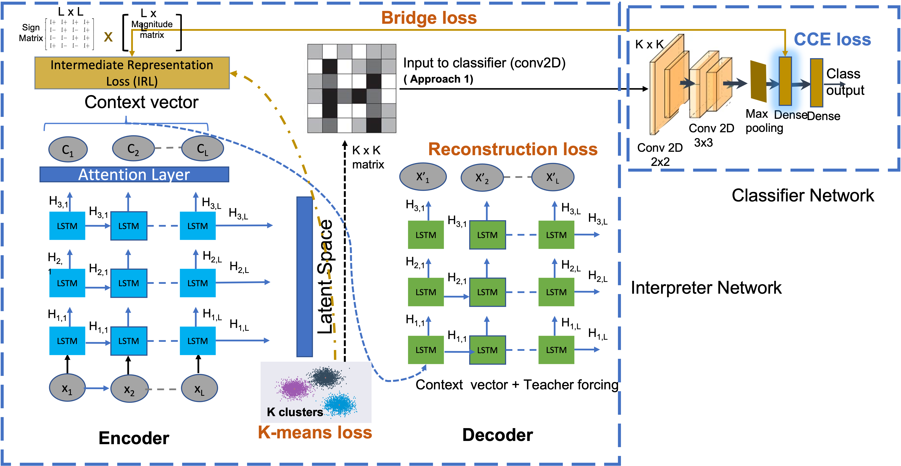

# Introduction

This code contains the implementations of the proposed CognitionNet-TM along with other baselines - CognitionNet-S and DTCR-alike (with Logistic Regression, SVM, Random Forest, XGBoost, ANN as classifiers). Entire code is written using Keras with TensorFlow2.x as backend. We publish the anonymized version of our train and test datasets to get familiarity with the workflows. The pipeline can be used for any custom datasets of choice.

This framework is a part of our review submission for the paper titled "CognitionNet: A Collaborative Neural Network for Play Style Discovery in Online Skill Gaming Platform". In this work, we focus on discovery of the “game behaviours” as micro-patterns formed by continuous sequence of games and the persistent “play styles” of the players’ as a sequence of such sequences on an online skill gaming platform for Rummy, as a case study. The complex sequences of intricate sequences is analysed through a novel collaborative two stage deep neural network, CognitionNet. The first stage focuses on mining game behaviours as cluster representations in a latent space (we leverage the work proposed in the paper [1]) while the second aggregates over these micro patterns (e.g., transitions across patterns) to discover play styles via a supervised classification objective around player engagement. In this submission, we make the following contributions:

1. To the best of our knowledge CognitionNet is the first network which collaboratively trains the two networks of different dimensional inputs to model sequence of sequences.

2. The clustered micro-patterns mined by the first network reveal interesting Game Behaviours, while the second network stitches these micro patterns to discover Players’ Play Styles. In doing so we combine game specific domain knowledge with research findings in the domain of player psychology.

3. CognitionNet introduces a novel formulation of bridge loss thereby eliminating dependency on fixed network architecture for the second network, thereby enabling domain specific customization.

</p>
Below figure shows the architecture of CognitionNet:
</p>
<div>

</div>

# Dependencies and Environment

Dependencies can be installed via anaconda. Below are the dependencies:

```
AWS Instance Used - g4dn.2xlarge(kernel - conda_amazonei_tensorflow2_p36):
  - GPUs==1
  - vCPUs==8
  - Mem(GiB)==32
  - GPU Memory(GiB)==16
  - Instance Storage(GB)==225
  - Network Performance(Gbps)==Up to 25

Keras with TensorFlow2.0 as backend environment:
- pip=20.0.2
- python=3.6.10
- pip:
    - ipython==7.15.0
    - ipython-genutils==0.2.0
    - matplotlib==3.1.3
    - numpy==1.18.1
    - scikit-learn==0.22.1
    - scipy==1.4.1
    - tensorflow-addons
    - tensorflow-estimator==2.2.0
```

# Data

The data could not be uploaded to here due to size constraints but can be downloaded and extracted as follows:

```
chmod +x data_extraction.sh
./data_extraction.sh
```

Data for training (`data/train/chunk_1.npy`) and testing (`data/test/chunk_2.npy`) is masked (for privacy reasons) and published under the data directory. Both the training data and test data being voluminous, we have converted them into python numpy formats. The training and test code directly runs on this format.

# Code Organization

Folder `training/` provides training procedure for CognitionNet-TM. Folder `models/` contains the CognitionNet network its architecture and loss functions including the bridge loss. The `explainability/` folder can be used to track and understand epoch based training losses. The `comparative_networks/` folder contains the CognitionNet-S and DTCR-alike networks. CognitionNet-TM, CognitionNet-S workflows only differ in terms of the classifier network. `CognitionNet-S.py` contains the training procedure for the CognitionNet-S network, where the only difference is the classifier. Both CognitionNet-S and CognitionNet-TM use the bridge loss.  
Classification_ML_Background ipython notebook contains local classifiers that we used for initial Background verfication (with Logistic Regression, SVM, Random Forest, XGBoost, ANN as classifiers ).
`dtcr.py` is the as is implementation of the DTCR network proposed in [1]. `dtcr_alike_classification.ipynb` ipython notebook contains extensive list of local classifiers that we used for comparison with DTCR-alike architecture. Though in the paper we only published DTCR-alike with Conv network (the alike classifier of CognitionNet-TM).

# Persona or Game Behaviour Illustrations

Due to player data confidentially agreements we cannot publish the player specific details as well as their data. We have added the various pdf's showing their playstyles and their dominant game behaviors via cluster statistics. Over and above what has been mentioned in the paper, the documenets here are only for the illustrative purpose. The details are available in the play_styles folder.

# Usage

This repository contains a demo of CognitionNet-TM using the dataset discussed in the submitted paper.
You can run the following commands:

## Data Extraction

```
chmod +x data_extraction.sh
./data_extraction.sh
```

## Training (CognitionNet-TM)

```
chmod +x train_runner.sh
./train_runner.sh
```

## Inferencing (CognitionNet-TM)

```
chmod +x inference_runner.sh
./inference_runner.sh
```

To reproduce DTCR-alike results with various classfiers, relevant cluster allocations are made available in `data/` folder(available after running `data_extraction.sh`) as train(chunk-1) and test(chunk-2) CSVs.

# Referrences

[1] Qianli Ma, Jiawei Zheng, Sen Li, Gary W. Cottrell. Learning Representations for Time Series Clustering. In Advances in Neural Information Processing Systems.
